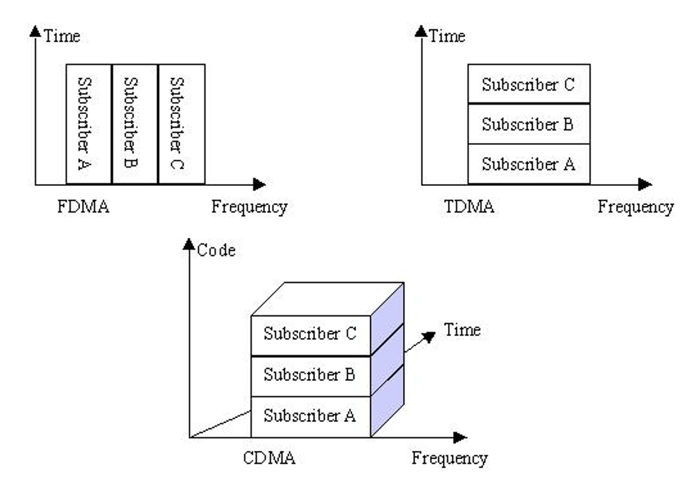
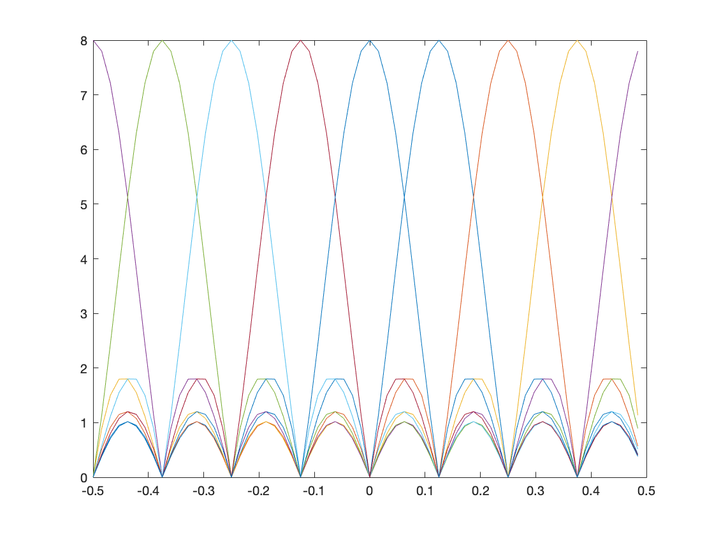
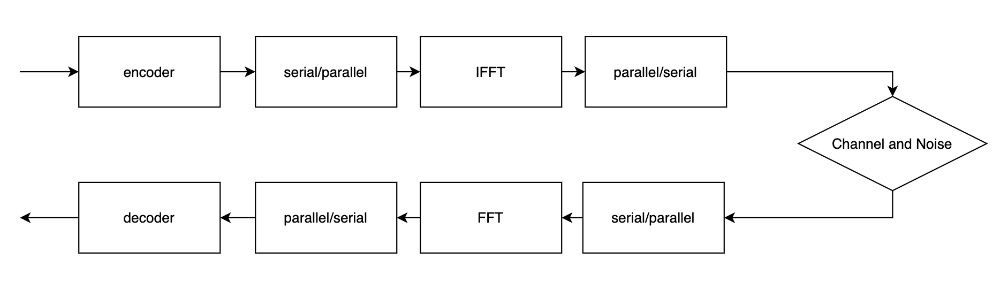
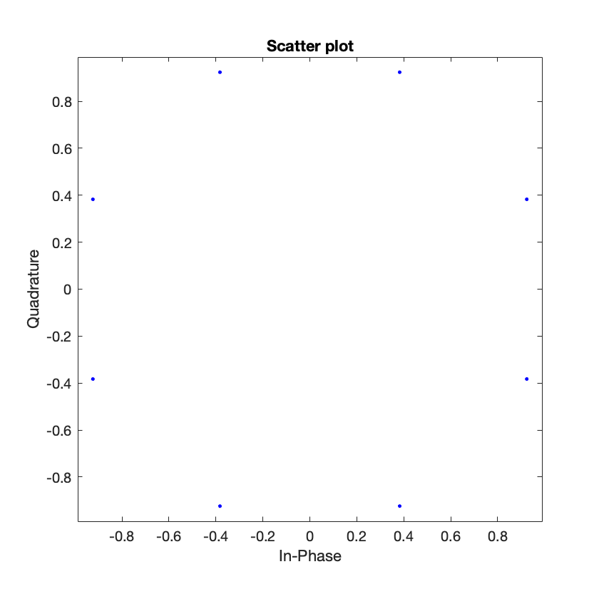
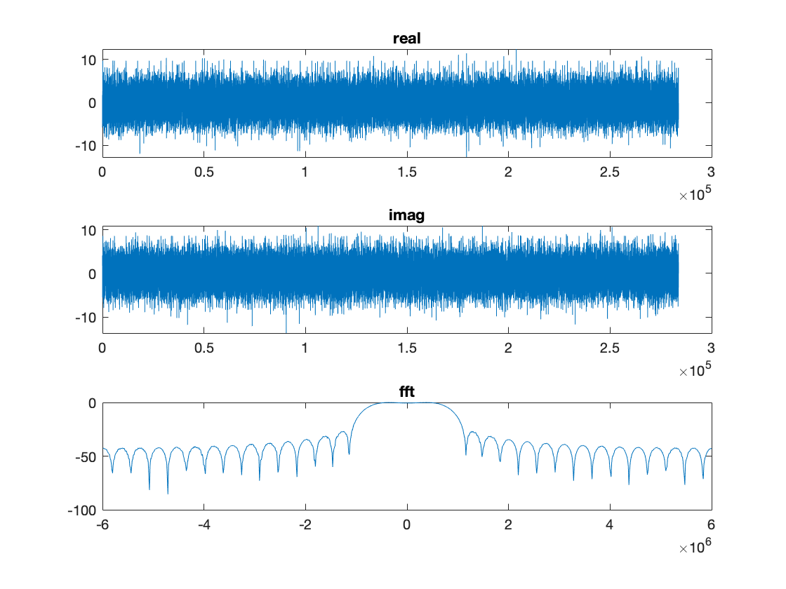
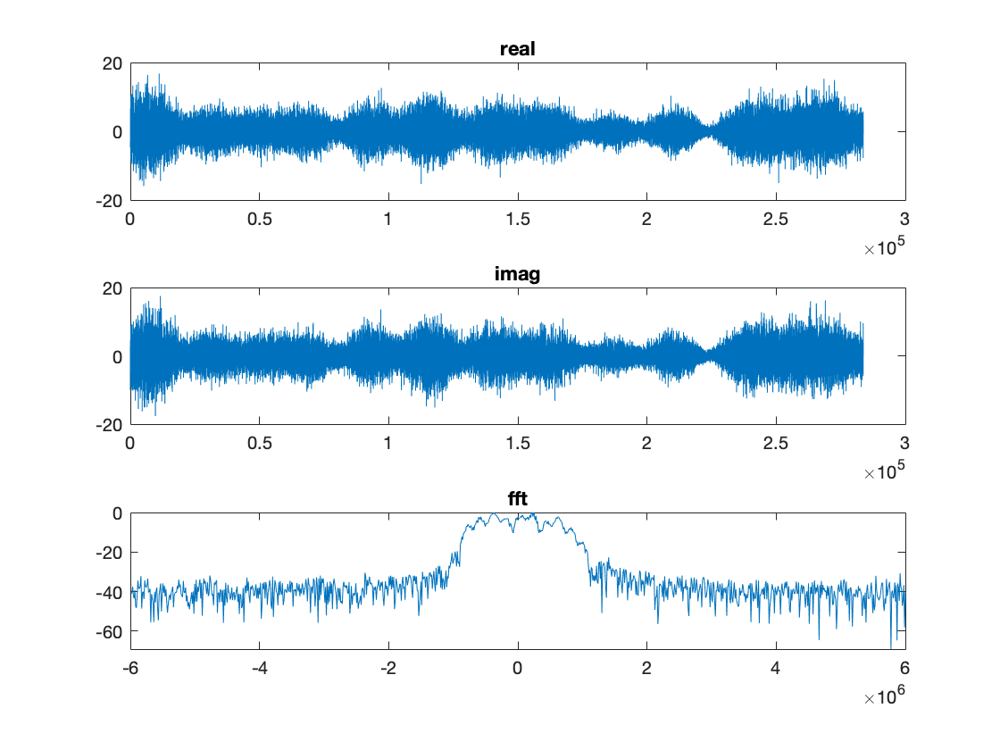
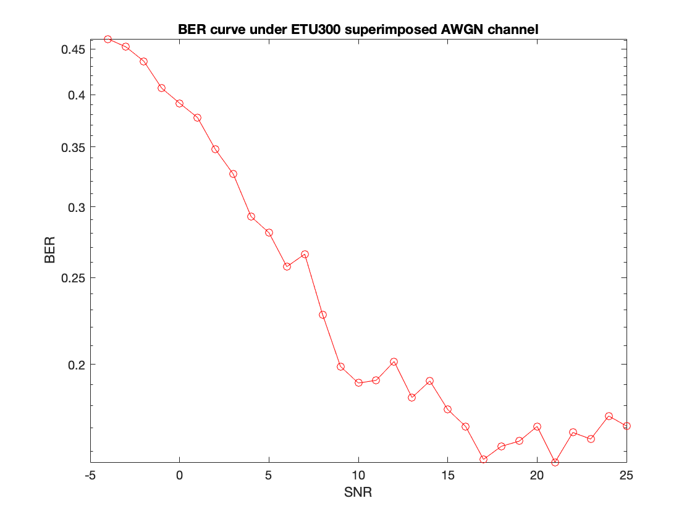

# OFDM Systems study and simulation
EEL6509 Wireless Communication Course Project Report

## [PDF Version](https://github.com/LiaoJJ/Study-and-Simulation-of-OFDM-Systems/blob/main/final_report.pdf)

## Abstract - A paragraph that summarizes the problem and the results.
In this report, we will firstly have a review of classic Multiple Access technology, TDMA, FDMA, and CDMA. Then for a higher channel utilization, we will improve FDMA to OFDM, which uses the channel more compactly. The later part of this report will focus on the experiment and simulation of OFDM. We will introduce our experiment details and display our experiment results. Finally, we will make a summary and conclusion.

## Introduction - Sets the context, describes the problem and describes your solution.
OFDM stands for Orthogonal Frequency Division Multiplexing, which is a special multi-carrier transmission scheme and can be regarded as a modulation technology or a multiplexing technology.

#### Classic Multiple Access technology: FDMA, TDMA, CDMA

1. FDMA
Frequency Division Multiple Access, FDMA. As the name suggests, FDMA uses different frequency bands to differentiate users i.e. the information of users is transmitted over different frequency bands but prevents interference between the signals of users.
As a multiple access tool, the first generation mobile communication system uses FDMA. Between each frequency point, corresponding security bands exist to ensure that the signal of each device is not interfered with by other users.

TDMA
Time Division Multiple Access, or TDMA. As the name indicates, to differentiate users, TDMA uses different time slots, i.e. the data of users are transmitted on different time slots to prevent interference between the signals of users.
The mobile communication system of the second generation adopts TDMA primarily as a multi-access process. Each slot's time will not overlap with each other to ensure that other users do not interfere with each user's signal.

CDMA
Code Division Multiple Access, CDMA, uses various code words to identify users. In other words, the data of users is scrambled with different code words to prevent interference between signals from users.

In combination with TDMA and FDMA, CDMA is also used so that the device can transmit data from multiple users on simultaneous and same-frequency wireless resources, and multiple user data can be identified by various sequences of code words.

#### OFDM

To put it simply, OFDM is a multi-carrier transmission system that divides the frequency band into multiple parallel data transmission sub-channels, splits the high-speed data stream into multiple low-speed parallel data streams, and then modulates the data for transmission to each channel's sub-carriers. Since it transforms the non-flat fading wireless channel into many sub-channels of orthogonal flat fading, it is possible to remove the interference between channel waveforms and achieve the objective of resisting multipath fading. As you can see in the below picture, the peak frequency is not interference by the neighbor channel

Its characteristic is that each subcarrier is orthogonal to each other, so the spectrum can overlap with each other after spread spectrum modulation, not only reducing the mutual interference between neighboring subcarriers but also significantly enhancing the use of the spectrum.

A major cause for choosing OFDM is that the device can resist selective fading of frequency and narrowband interference well. Fading or interference in a single carrier system will cause the entire connection to fail, but only a small set of sub-channels will be affected by deep fading at a specific time in a multi-carrier system.

## Description - One or more sections that describe the problem and your approach to the solution in detail.

## High-Level Principle of OFDM

## 3 Basic Principles
3.1 Typical transceiver of the OFDM system

The upper part refers to the transmitter and the lower part is the receiver.

The transmitter transforms the converted digital signal into the subcarrier amplitude and phase, and data spectrum expression will be transformed into the time domain by performing the Discrete Fourier transform (IDFT). The transformation of IFFT and IDFT have the same functionality but have improved computational efficiency, so they apply to all applications. The receiver conducts the reversed operation to the transmitter, and to decompose the amplitude and phase of the subcarrier to the digital signal, where the FFT transform is used.

3.2 OFDM modulation and demodulation

An OFDM symbol is a mixed-signal of multiple modulated subcarriers, which could be modulated by PSK and QAM.

The OFDM transmitter transforms the bit-stream information into a sequence of PSK or QAM symbols, and then converts the sequence of serial symbols to a parallel symbol stream. Every N of the converted symbols will then be modulated by a different subcarrier.

The OFDM symbol is a mixed parallel symbols signal. The single serial symbol transmission time is Ts, the OFDM symbol duration is Tsym=N*Ts.

Frequency in frequency domain modulation signal X[k] is: fk=k/Tsym, where k= 0,1,2... N - 1.

## Some modules involved

#### Channel coding

Errors could occur in the signal transmission phase due to the interference and fading, as a result, correction and detection technology, the coding technology, must be integrated for digital signals to enhance the capability to resist interference as data is transmitted in the channel and increase device reliability. Here the channel encoding adopts convolutional encoding and Viterbi decoding.

In modern digital communication systems, Convolutional encoding is a standard forward error correction code. The output of convolution encoding is related not only to the information symbol input at the current moment but also to the information symbol input before, unlike traditional linear block codes.

## Interleaving

Interleaving is to transform a sudden error into a random error, which helps interpret the code for forwarding error correction and increases the efficiency of the entire communication system. Interleaving is consist of two transformation processes. The first transformation makes sure that non-adjacent subcarriers are converted with adjacent code bits. The second transformation makes sure that the neighboring encoding bits are assigned to the constellation's significant and non-significant bits coordinately, preventing low bit mapping for a long time.

This system uses a kind of generic interleaved, which are commonly used in communication systems. The interleaving method is defined as follows: the sequence of input information is first written in the order of rows into a matrix, and then the data is read out as columns. The corresponding method of de-interleaving is to write the data in columns into the same matrix and read it out in rows.

#### Pilot

The pilot does not carry information. Both parties are aware of the pilot and it is used for channel estimation. Though channel equalization and frequency deviation correction can be done in the receiver by utilizing the segment training sequence and the long training sequence obtained, the symbol could still have residual deviation, which could accumulate over time and trigger a certain phase offset for all subcarriers. Therefore, keeping track of the reference process is important.

#### Protection Interval

Multipath channels have an ISI effect that breaks the orthogonality between subcarriers on the OFDM. Therefore certain methods need to be implemented to eliminate the impact of inter-symbol interference (ISI) induced by multipath channels, i.e. Protection Interval.

For the protection interval, there are two insertion methods: one is to fill in zero (ZP), that is, to fill in zero in the protection interval; the other is to insert cyclic prefix (CP) or cyclic suffix (CS) in order to achieve cyclic OFDM extension (for some continuity).

In this case, intercarrier interference (ICI) will be generated due to the effect of multipath propagation, i.e. interference between different subcarriers will be generated. Zp does not insert any signal into the security interval.

CP is commonly adopted. Cp is to copy the sample to the front on the back of OFDM, and the length is Tcp, so Tsym=Tsub+Tcp is the length of each symbol, and Tsub is the data part's molecular carrier number. The ISI effect between symbols will be limited to the security interval when Tcp is greater than or equal to multipath delay, so the FFT transform of the next OFDM will not be affected.

## Evaluation - A section that quantitatively evaluates your ideas.

## Selection of basic OFDM parameters
5.1 In multi-requirement disputes, the selection of different OFDM criteria calls for consensus consideration. Generally speaking, it is important to first define 3 parameters: bit rate, bandwidth, and protection interval.

5.1.1 The duration of the protection interval should be 2-4 times the RMS of the delay extension of the mobile environment channel, in compliance with the convention.

5.1.2 The OFDM symbol cycle length is calculated after the protection interval. The OFDM symbol duration length is much longer than the protection interval length, to reduce the loss of SNR caused by the insertion of protection bits. The symbol length can not, however, be arbitrarily long, or it would require more subcarriers. The subcarrier interval will become smaller with the constant bandwidth, and the system's implementation complexity will be increased. Furthermore, the system's peak average power ratio will also be improved and the system will be more adaptive to the deviation of frequencies. Therefore in general, the length of the symbol duration is 5 times the protection interval. So, the loss in the SNR caused by the safety bits insertion is just around 1dB.

5.1.3 The number of subcarriers can be calculated by dividing the -3 dB bandwidth of the subcarrier intervals after the protection intervals and the symbol time length is calculated. Or, by splitting the necessary bit rate by the bit rate per subchannel, the number of subcarriers can be calculated. In each channel, the bit rate transmitted can be calculated by the form of modulation, the encoding rate, and the rate of symbols.

5.2 Useful symbol duration T

The time between subcarriers and the waiting period for decoding is influenced by T. The number of subcarriers and the length of the FFT should be reasonably high to preserve data throughput, resulting in a longer symbol span. In other words, the choice of the duration of the symbol span is based on the principle of ensuring the channel's stability.

5.3 Number of subcarriers

N = 1 / T

Its value is proportional to the number of complex points processed by the FFT and could be tailored to the data rate and protection interval requirements.

5.4 Mode for modulation

Based on power and spectrum consumption, the modulation mode of the OFDM system is selected. It is possible to use QAM and PSK.

The complex numbers mapped by the binary sequence should be normalized for all points to having the same average power. (Multiplied by 1, 1/SQRT(2), 1/SQRT(10), 1/SQRT(42) by BPSK\QPSK\16QAM\64QAM) and then demodulated.

5.5 Illustrate with specific examples;

Requirements :(1) a bit rate of 25Mbit/s (2) a time delay extension of 200ns (3) bandwidth less than 18MHz.

1) The protection interval is expanded from 200ns delay to 800ns;

2) Symbol cycle length 6*800ns=4.8us according to 800ns protection interval;

3) The interval of subcarriers is selected as the reciprocal of 4.8-0.8= 4US, i.e. 250KHz;

4) according to the ratio between the required bit rate and OFDM symbol rate, the bits to be transmitted for each symbol :(25Mbit/s)/(1/4.8us) =120bit.

5) To complete the above 120bit/ symbol, there are two choices: using 16QAM and code method with a code rate of 1/2, so that each subcarrier carries 2 bits of useful information, so 60 subcarriers are needed; The other is the use of QPSK and code rate of 3/4, each subcarrier carries 1.5bit information. Therefore, 80 subcarriers are needed. However, 80 subcarriers have unexpected bandwidth: 80*250KHz=20MHz, which is greater than the required bandwidth. Therefore, the first type, namely 60 subcarriers, is chosen. 64 IFFT can be used to achieve, the remaining 4 subcarrier complement 0.

## Experiment Result

The time and frequency domain image of data sent

A time and frequency domain image through an ETU300 multipath channel

Constellation image before receiving signal demodulation

BER v.s. SNR

Our result shows that when the SNR is greater than 15dB, there is no significant decrease. 

## Summary and Conclusions - Summarize what you did and what interesting things you learned from the project.
In this report, we firstly introduce 3 classic Multiple Access techniques, TDMA, FDMA, CDMA. Then from FDMA, we introduce the OFDM which utilize frequency channel more efficiently. Then we introduce our simulation and experiment in Matlab. Finally, we display and analyze our results.

## Reference list
- Cho, Yong Soo, Jaekwon Kim, Won Y. Yang, and Chung G. Kang. MIMO-OFDM wireless communications with MATLAB. John Wiley & Sons, 2010.
- Rappaport, Theodore S. Wireless communications: principles and practice. Vol. 2. New Jersey: prentice hall PTR, 1996.
- Nee, Richard van, and Ramjee Prasad. OFDM for wireless multimedia communications. Artech House, Inc., 2000.
Stuber, Gordon L., John R. Barry, Steven W. Mclaughlin, Ye Li, Mary Ann Ingram, and Thomas G. Pratt. "Broadband MIMO-OFDM wireless communications." Proceedings of the IEEE 92, no. 2 (2004): 271-294.
- Li, Xiaodong, and Leonard J. Cimini. "Effects of clipping and filtering on the performance of OFDM." In 1997 IEEE 47th Vehicular Technology Conference. Technology in Motion, vol. 3, pp. 1634-1638. IEEE, 1997.
- Cimini, Leonard J., and Nelson R. Sollenberger. "Peak-to-average power ratio reduction of an OFDM signal using partial transmit sequences." IEEE Communications Letters 4, no. 3 (2000): 86-88.
- Van De Beek, J-J., Ove Edfors, Magnus Sandell, Sarah Kate Wilson, and P. Ola Borjesson. "On channel estimation in OFDM systems." In 1995 IEEE 45th Vehicular Technology Conference. Countdown to the Wireless Twenty-First Century, vol. 2, pp. 815-819. IEEE, 1995.
- Prasad, Ramjee. OFDM for wireless communications systems. Artech House, 2004.
Dent, Paul W. "TDMA/FDMA/CDMA hybrid radio access methods." U.S. Patent 5,539,730, issued July 23, 1996.
- Galda, Dirk, and Hermann Rohling. "A low complexity transmitter structure for OFDM-FDMA uplink systems." In Vehicular Technology Conference. IEEE 55th Vehicular Technology Conference. VTC Spring 2002 (Cat. No. 02CH37367), vol. 4, pp. 1737-1741. IEEE, 2002.
- Priyanto, Basuki E., Humbert Codina, Sergi Rene, Troels B. Sorensen, and Preben Mogensen. "Initial performance evaluation of DFT-spread OFDM based SC-FDMA for UTRA LTE uplink." In 2007 IEEE 65th Vehicular Technology Conference-VTC2007-Spring, pp. 3175-3179. IEEE, 2007.
- Li, Xiaodong, and Leonard J. Cimini. "Effects of clipping and filtering on the performance of OFDM." In 1997 IEEE 47th Vehicular Technology Conference. Technology in Motion, vol. 3, pp. 1634-1638. IEEE, 1997.
- Wong, Cheong Yui, Roger S. Cheng, K. Ben Lataief, and Ross D. Murch. "Multiuser OFDM with adaptive subcarrier, bit, and power allocation." IEEE Journal on selected areas in communications 17, no. 10 (1999): 1747-1758.
- Li, Y. L. J. C., Leonard J. Cimini, and Nelson R. Sollenberger. "Robust channel estimation for OFDM systems with rapid dispersive fading channels." IEEE Transactions on communications 46, no. 7 (1998): 902-915.
- M. Zi, 'OFDM Complete Simulation Process and Interpretation (MATLAB)', 2019. [Online]. Available: https://zhuanlan.zhihu.com/p/57967971. [Accessed: 16- Dec- 2020].
- D. Du, 'Matlab - OFDM communication link simulation', 2020. [Online]. Available: https://zhuanlan.zhihu.com/p/139381223. [Accessed: 16- Dec- 2020].
- Y. Guan, 'MATLAB simulation of OFDM communication system', 2020. [Online]. Available: https://www.cnblogs.com/gjblog/p/13352746.html. [Accessed: 16- Dec- 2020].
- LTE, '2.3 - OFDM/ OFDMA IN 4G LTE - PART 1', 2016. [Online]. Available: https://youtu.be/rKy5dOl3Et4. [Accessed: 16- Dec- 2020].
- C. Sunny, 'OFDM - Orthogonal Frequency Division Multiplexing', 2018. [Online]. Available: https://youtu.be/KCHO7zlU25Q. [Accessed: 16- Dec- 2020].
- Mayank, 'ofdm frequency plot.m', 2014. [Online]. Available: https://www.mathworks.com/matlabcentral/fileexchange/46328-ofdm-frequency-plot-m. [Accessed: 16- Dec- 2020].
- D. Ma, 'Explain the principle of OFDM to the "Xiaobai" diagram', 2014. [Online]. Available: https://blog.csdn.net/madongchunqiu/article/details/18614233. [Accessed: 16- Dec- 2020].